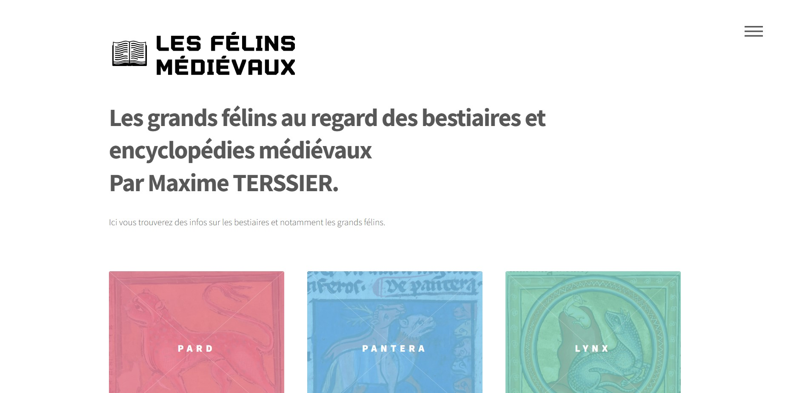
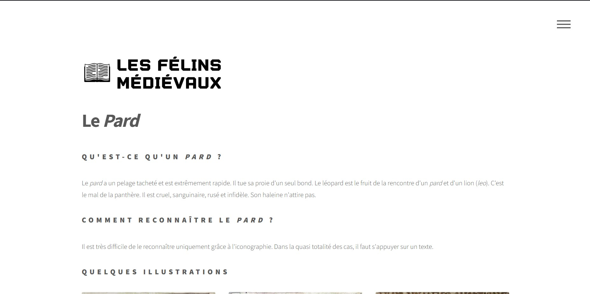
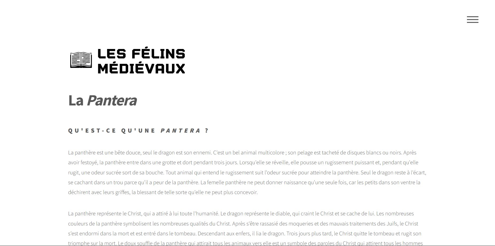
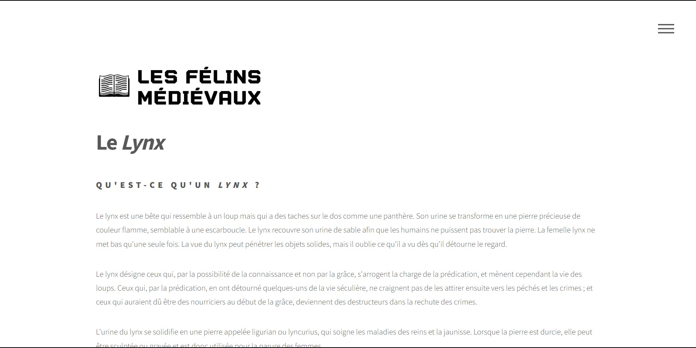
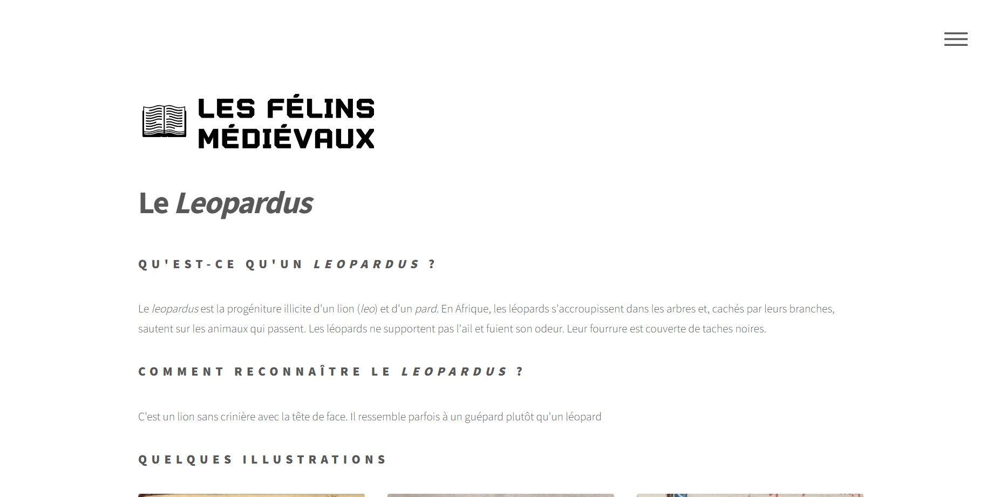

# Humanités Numériques

Ce projet est hébergé sur [GitHub](https://github.com/Blerkkk/humanites-numeriques/tree/main/humanites-numeriques).

## Description

Site réalisé dans le cadre des Humanités numériques, qui traite de mon mémoire, les grands félins dans les encylopédies et bestiaires médiévaux.

## Structure du projet

- **Dossier principal** : Contient les fichiers sources ainsi que les dossiers des assets et des images
- **Dossier images** : Contient toutes les images utilisées.
- **Dossier assets** : Contient toutes les assets utilisées par le site pour son fonctionnement.

## Captures d'écran

- **Accueil** : 
- **Pard** : 
- **Pantera** : 
- **Lynx** : 
- **Leopardus** : 

## Commentaires

Je n'ai pas énormément de choses à ajouter. J'ai choisi sur HTML5UP un template dont j'aimais les couleurs (ici le modèle phantom). Mon mémoire portant sur du texte ainsi que quelques images, je n'ai pas vraiment de code couleur à respecter, ni quelconque logique de couleurs. Concernant les illustrations sélectionnées pour chaque animale, j'ai essayé d'en prendre une de bonne qualité, une assez représentative de l'animale et une qui n'a vraiment rien à voir, pour montrer la difficulté de la recherche.

## Licence

Ce projet est sous licence MIT (ou toute autre licence applicable).
